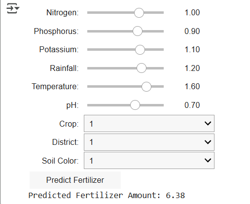

# Smart-Farming-Fertilizer-Recommendation-System-
Predict optimal fertilizer amounts for enhanced crop yield using      soil and environmental data.
Project Overview
This project focuses on predicting the optimal amount of fertilizers needed to enhance crop yield using soil and environmental data. It aims to assist farmers in making data-driven decisions to improve productivity and sustainability in agriculture.

Learning Objectives
Understand and preprocess agricultural datasets with soil and crop parameters.

Build and tune machine learning regression models (Random Forest, Gradient Boosting, XGBoost) for fertilizer prediction.

Analyze model interpretability using SHAP (SHapley Additive exPlanations) to explain feature importance.

Develop an interactive user interface for real-time fertilizer recommendations.

Gain hands-on experience with data scaling, encoding, and hyperparameter optimization.

Tools and Technologies Used
Programming Language: Python

Libraries: pandas, numpy, scikit-learn, xgboost, matplotlib, shap, ipywidgets

Machine Learning Models: Random Forest Regressor, Gradient Boosting Regressor, XGBoost Regressor

Development Environment: Jupyter Notebook, Google Colab

Interface: ipywidgets for interactivity within notebook

Visualization: Matplotlib, SHAP plots

Project Details
Data Collection and Preprocessing
Loaded the Crop and Fertilizer dataset.

Removed unnecessary columns, handled missing values by deleting incomplete rows, and eliminated duplicate records.

Encoded categorical variables such as District, Crop, and Soil color using Label Encoding.

Scaled numerical features like Nitrogen, Phosphorus, Potassium, Rainfall, Temperature, and pH using StandardScaler for normalization.

Model Building and Hyperparameter Tuning
Applied multiple regression models: Random Forest, Gradient Boosting, and XGBoost.

Used GridSearchCV with cross-validation to find optimal hyperparameters.

Evaluated model performance using RMSE, MAE, and R² metrics on the test data.

Explainability and Recommendations
Applied SHAP to interpret the importance of input features.

Generated fertilizer level recommendations based on model predictions for single and combined features.

Interactive Interface
Built an interactive input form using ipywidgets within Jupyter Notebook/Google Colab.

Enabled real-time fertilizer amount prediction based on user inputs for soil and crop features.

Problem Statement
Farmers often face challenges in identifying the right type and quantity of fertilizer, which can lead to underuse or overuse, impacting yield and the environment. This project aims to develop a data-driven machine learning system to optimize fertilizer use, enhancing both productivity and sustainability.

## Project Snapshot

Results
Developed a robust machine learning pipeline with Random Forest achieving RMSE ≈ 1.6 and R² ≈ 0.89.

Provided transparent model interpretation via SHAP, identifying critical soil and crop factors influencing fertilizer needs.

Delivered actionable fertilizer recommendations to help farmers optimize crop yield and reduce waste.

Created a user-friendly interactive tool for fertilizer prediction accessible to non-technical users.

Future Work
Deploy the system as a web or mobile application.

Integrate real-time sensor data for live updates.

Expand the model to include more crops and geographical regions.
